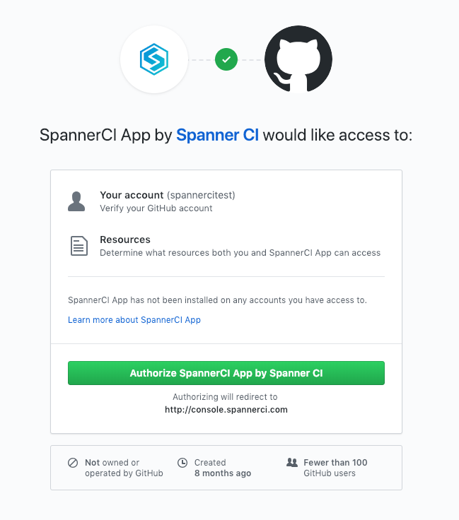
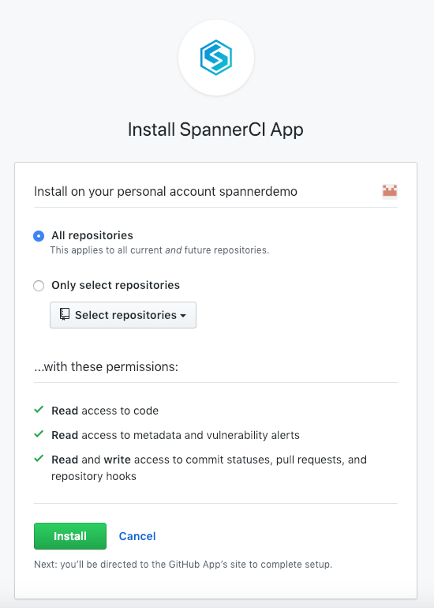
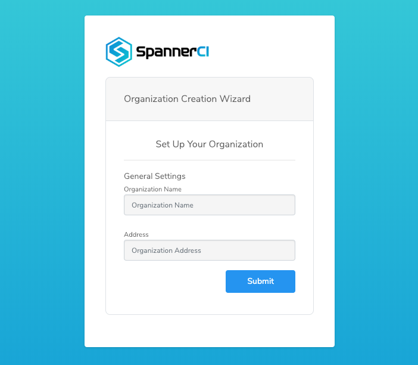
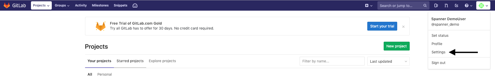
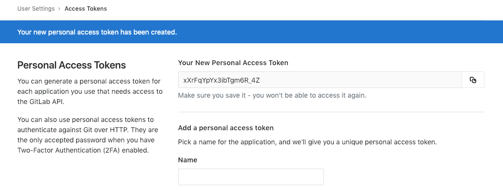
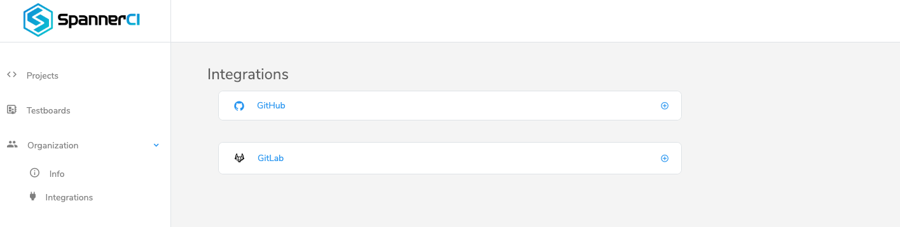
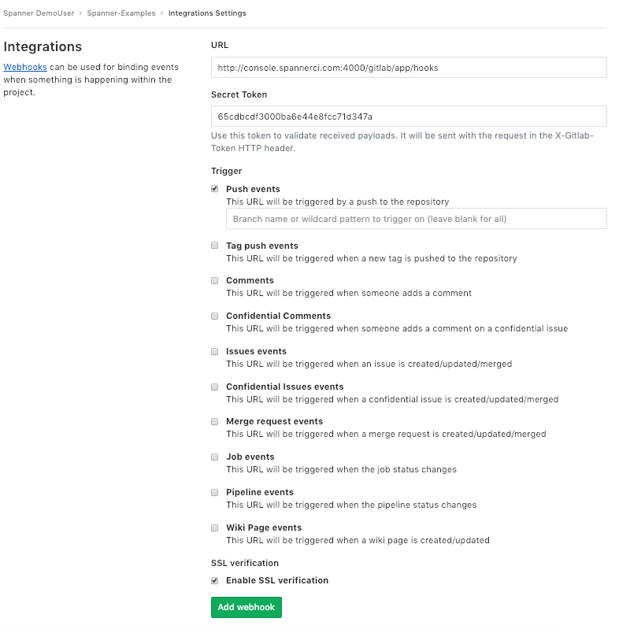

# Spanner CI #

## Table of Contents
* [Introduction](#introduction)
* [How It Works](#how-it-works)
* [Creating An Account](#creating-an-account)
* [Integrations](#integrations)
     * [GitHub ](#github-through-spanner-ci-official-github-app)
     * [Gitlab ](#gitlab-through-webhook)
* [Spanner CI Permission Scopes](#spanner-ci-permission-scopes)
* [Projects](#projects)
* [Jobs](#jobs)
* [Environment Variables](#environment-variables)
* [Configuration with .spannerci.yml](#configuration-with-spannerciyml)
* [Test Scripts](#test-scripts)
* [Testboards](#testboards)
* [Spanner CLI](#spanner-cli)
* [Quick Start Guide](#quick-start-guide)

## Introduction
[Spanner CI](https://spannerci.com) is a Continuous Integration Platform for IoT and Embedded Devices. It can be used for automated code quality checks, automated firmware builds and automated functional tests in real hardware that run with every new version of your firmware.

This repository contains everything that is needed to get started with Spanner CI. It's highly recommended to make a fork of this repository and use it as a starting point to understand how Spanner CI can be easily integrated with your own github or gitlab repository. More details about this can be found in the [Quick Start Guide](#integrations) section.

In the following sections you'll find detailed information about Spanner CI.

## How It Works
As soon as we create an account and make a new Project in Spanner CI Platform, we can add a [.spannerci.yml](#configuration-with-spannerciyml) configuration file in the root directory of our source code repository to trigger Spanner CI for every commit or pull request. Each time Spanner CI is triggered, it reads the instructions from `.spannerci.yml` file and starts one or more virtual environments for firmware code quality checks, firmware builds or functional testing of the hardware. In the latter case, a user-defined test script is provided in the `.spannerci.yml` file that contains all the device functional tests. Before running the tests, each device under test is updated with the new firmware. Moreover, a Spanner [Testboard](#testboards) can be used to test all inputs and outputs of our device. The Testboard is connected both with the device (wired or wireless) and with the Spanner Platform over the network. Please make sure to check the [Quick Start Guide](#quick-start-guide) section for more details.

## Creating an Account
If you haven't used Spanner CI before, you can create a new account by visiting the [Create an Account](http://console.spannerci.com/app/accounts/register) page. To sign-up, you can either use your GitHub account (recommended) or create a new account directly from Spanner.

#### Option 1: Sign-Up with GitHub ###
If you already have a GitHub account click the `SIGN UP WITH GITHUB` button. This will redirect you to GitHub to authorize then you'll be automatically sign-in to the Spanner CI Platform where you can fill your organization info. After that you have to go to integrations, click the `GitHub App` and then the `Install App on Github ` button so as to install the Spanner CI App, which will complete the integration with GitHub and start using Spanner. That's the recommended way to sign-up because it doesn't require further actions regarding the Spanner integration with GitHub. Details about the GitHub integration can be then found under the [Integrations](http://console.spannerci.com/app/integrations) page.

#### Option 2: Regular Sign-Up ###
1. Enter your basic information and click `REGISTER` to continue.
2. Use the credentials provided above to sign-in.
3. Enter your organization info to access the Spanner UI. Next step is to integrate Spanner CI with GitHub.
4. Go to the [Integrations](http://console.spannerci.com/app/integrations) page under the Organization section.
5. Under the available integrations, click the `GitHub App` and then the `Authenticate Github ` button. This will redirect you to GitHub to authorize. After that you will be redirected back to Spanner CI console. You have to go back to integrations, click the `GitHub App` and then the `Install App on Github ` button so as to install the Spanner CI App, which will complete the integration with GitHub.

## Integrations
[Spanner CI](https://spannerci.com) integrations gives you and your organization full visibility into your GitHub or Gitlab projects right in Spanner CI Platform, where you can create projects based on your code repositories

This readme contains everything that is needed to get started using Spanner CI integrations. It's highly recommended to use it as a starting point to understand how Spanner CI can be easily integrated with your own Github or Gitlab [ private | public ] repository. More details about this can be found below. Follow the Quick Start Guide to start using Spanner CI Integrations.

#### GitHub (through Spanner CI Official Github App)


* Step 1: If you already have a GitHub account click the `SIGN UP WITH GITHUB` button on the [Spanner CI Platform](https://console-spannerci.com). This will redirect you to GitHub authorisation page:



* Step 2: You will be prompted to give the app access:




* Step 2: Then you'll be automatically sign-in to the Spanner CI Platform where you can fill your organization info



That's the recommended way to sign-up because it doesn't require further actions regarding the Spanner integration with GitHub.

Details about the GitHub integration can be then found under the Integrations page.


#### Gitlab (through Webhook)


* Step 1: If you already have a Gitlab account, go to the [Gitlab Profile Settings](https://gitlab.com/profile/)



* Step 2: Click on Access Token on the Left Sidebar Menu
* Step 3: Give a friendly name to your Access Token and Choose api scope from the checkboxes in order to give access to Spanner CI retrieve your repository info as shown in the above page:


* Step 4: Copy the generated token to your clipboard in order to paste it on Spannner CI Platform



* Step 5: Sign in to [Spanner CI Platform](https://console-spannerci.com)
* Step 6: Click on Integrations on Left Sidebar Menu



* Step 7: Click on Gitlab Integration and wait for a pop-up window with Gitlab Configuration Settings
* Step 8: Once the Pop-Up window is appeared, paste the generated access token from clipboard to the corresponding field in order to give access to Spanner CI retrieve your repository info


Update the access token to Spanner CI platform Integrations as many times as you want.

Do not forget to save your Gitlab access token - you won't be able to access it again.

* Step 9: If you want to trigger Spanner CI on each push / pull request you have to copy the generated Gitlab Webhook Secret Token from Spanner CI (as shown in the above image) and click on Integrations in your Gitlab Project.

* Step 10: Fill the URL with http://console.spannerci.com:4000/gitlab/app/hooks and paste your Webhook Secret Token. Choose Trigger events (Push or/and Merge request events) whenever you want to trigger Spanner CI.





## Spanner CI Permission Scopes

#### GitHub Permission Scopes

|Permission scope|Why we need it|
|---|---|
|Read access to code| To clone repository code in Spanner CI Projects|
|Read and write access to commit statuses, pull requests, and repository hooks | To trigger Spanner CI platform in each pull / push request|
|Read access to metadata and vulnerability alerts | To read repositories's metadata and any alerts|


#### Gitlab Permission Scopes

|Permission scope|Why we need it|
|---|---|
|api| Grants Spanner CI complete read/write access to the API, including all groups and projects.|

## Projects
Spanner supports the creation of one or more Projects for working with different repositories. Each Project represents one user repository. To create a new Project:

1. Select Projects from the navigation menu on the left side of the dashboard.
2. Click on New Project.
3. Select the preferred source code repository.
4. Add one or more [Testboards](#testboards).
5. Click Finish to complete the Project creation.

## Jobs
Each time Spanner CI is triggered from a source code commit or pull request a new Job is created automatically. Every Job gets the instructions on what to do from the [.spannerci.yml](#configuration-with-spannerciyml) file and then runs inside a virtual environment. Upon completion, Jobs provide the output result for each running stage and the resulted artifacts (e.g firmware binaries), if any. Moreover, in the `Testing` stage, the output result for each test case is provided.

New Jobs can also be created manually. Each Job belongs to a specific Project. A list with all the Project Jobs can be found under the Project page (accessible by clicking a Project name in the [Projects](http://console.spannerci.com/app/) page). From there, it's possible to get various information about each Job, download any artifacts or even watch any Job in runtime or at a later time.

Also note, that because of the Spanner integration with GitHub & Gitlab, it's possible to watch the Job result directly from GitHub or Gitlab, after creating a new Pull Request.

## Environment Variables
Spanner supports the definition of environment variables for each Project. These are variables that will be imported in the Linux based virtual environment that runs a [Spanner Job](#jobs). They are defined from `Environment Variables` section in the Project Settings page. They can be referenced in the [.spannerci.yml](#configuration-with-spannerciyml) file using the `$` prefix, e.g `$MY_VAR`, and we use them in two diferrent ways:
    a) as a value to a stage parameter, e.g `devices: $DEVICE_ID` and
    b) inside the `env_vars` parameter that will import them directly in the virtual environment, for example:

```
env_vars:
    - $DB_NAME
    - $ACCESS_TOKEN
```

In the latter case, we can reference them as Linux environment variables inside the Python test script, for example:

```python
os.environ['DB_NAME']
os.environ['ACCESS_TOKEN']
```

All the environment variables inside [.spannerci.yml](#configuration-with-spannerciyml) must be defined also to the related section in the Project Settings page of Spanner CI console.

Spanner supports a number of pre-defined environment variables, that are either mandatory to use some of the Spanner builders and OTA update methods or just convenient. All Spanner environment variables start with the `SPN_` prefix.
For example:
- `SPN_BUILDER_SDK`: is the SDK directory of the selected builder
- `SPN_PROJECT_DIR`: is the directory in which the source code repository is cloned in the virtual environment
- `SPN_OUTPUT_BINARY`: is the filename of your generated binary for testing section use.

  ...

Please contact us to get a full list of the Spanner pre-defined environment variables.

## Configuration with .spannerci.yml
Spanner CI enables continuous integration by adding a `.spannerci.yml` file in the root directory of your repository. This, together with some more configuration options that are mentioned later, make every new commit or pull request to automatically trigger Spanner.

Basically, the `.spannerci.yml` tells Spanner what to do. By default, it runs with three stages:

1. `code_qa` stage for code quality checks
2. `build_binary` stage for firmware builds
3. `testing` stage for functional tests on real hardware

You don't need to use all the above stages and stages with no definitions will be ignored. Each stage contains definitions on what to do. A sample `.spannerci.yml` file is shown below:

```
code_qa:
    level: basic
    source: firmware/

build_binary:
    builder: 'particle photon'
    binary_name: 'firmware/target/firmware.bin'
    script: cd $SPN_BUILDER_SDK && make PLATFORM=photon APPDIR=$SPN_PROJECT_DIR/firmware

testing:
    script: testing/basic-tests/GPIO/read-digital-output/scenario.py
    env_vars:
        - $SPN_PARTICLE_TOKEN
    device_update:
        devices:
            - $DEVID_1
            - $DEVID_2
        ota_method: 'particle'
        binary: auto
```

A stage is defined by a list of parameters that define the stage behavior.

| Keyword | Required | Description |
| :--- | :--- | :--- |
| level         | No  | Defines the Spanner Service level |
| builder       | Yes | Defines the preferred build environment (1) |
| binary_name   | Yes | Path of the generated binary file based on the SDK platform's documentation
| env_vars      | No  | Defines a list with environment variables that will be passed in the virtual environment |
| source        | Yes | Defines the source directory of the firmware |
| script        | Yes | Defines the script path or command to execute |
| device_update | No  | Enables OTA update of devices before testing |
| devices       | Yes | Defines a list of devices to apply the OTA update |
| ota_method    | Yes | Defines the preferred method for OTA updates (2) |
| binary        | Yes | Defines the binary source for OTA updates (auto, URL or repo path) |
| pre_flight    | No  | Override a set of commands that are executed before stage |
| post_flight   | No  | Override a set of commands that are executed after stage |

(1),(2): Please contact us to get a full list of the currently supported device builders and OTA update methods. To get started, make sure to check the [Quick Start Guide](#quick-start-guide) section.

## Test Scripts
Test Scripts are user defined scripts that contain a list of functional tests to be performed in one or more devices. Currently, they can be written in Python and we can trigger them by using the `script` parameter from the `Testing` stage. Test Scripts are executed within a virtual Linux based environment. In the most primitive form, a test script looks like the one below:

```python
import Spanner

def validate_dummy_test_case():
    Spanner.assertTrue(1);

if __name__ == "__main__":
    validate_dummy_test_case()
```

In the above example, the validate_dummy_test_case() test case will pass because the assertion performed in this test case is true. Assertions provided by the `Spanner` module and cover various types of values.

One of the most important aspects of Spanner Test Scripts are the Spanner [Testboards](#testboards), that enable the user to write hardware-in-the-loop functional tests. In other words, user is able to test the inputs and outputs of the device. Testboards can be added to the test scripts by importing the `Testboard` module. For example:
```python
from Testboard import Testboard
testboard = Testboard("testboard_name")
```

Example Test Scripts can be found under `testing` folder in this repository. Choose the one that you want to experiment with by defining the right path in the `script` parameter of `Testing` stage. The Test Scripts are split into three categories:

* `1.basic-tests`, which only perform one action and one test, to showcase that individual test function
* `2.simple-tests`, which perform a simple real-world scenario, i.e. *Turn Light on through Network Command*
* `3.complex-tests`, which perform a more common and complex real-world scenario, and whose goal is to showcase what an actual Functional test for a real product would test, with more than one assertions and using multiple APIs.

Each Test Script contains documentation for the specific use case. To understand the usage of Test Scripts, make sure to check the [Quick Start Guide](#quick-start-guide) section.

## Testboards
Spanner Testboards are hardware boards loaded with custom firmware from Spanner. They enable the control of inputs and outputs of the Product either wired or wireless. They communicate with Spanner CI Platform over a network interface. Testboards can be added from the [Testboards](http://console.spannerci.com/app/testboards) Page in the Spanner CI Platform and they can be then assigned to a Spanner Project. To add a new Testboard, the Testboard's Device ID is needed, which is printed on the board. The Testboard name can be used in the [Test Scripts](#test-scripts) to refer to a specific Testboard.

## Spanner CLI
Spanner provides a Command Line Interface (CLI) which can be used instead of the Web Interface. For more information please contact us.

## Quick Start Guide
This section is a step-by-step guide for all the new Spanner CI users. If you still have questions, please contact us.

The structure of the current repository is shown below:
* firmware: This folder contains an example firmware application for the [Particle](https://www.particle.io) Photon device.
* testing: This folder contains a number of example [Test Scripts](#test-scripts).
* .spannerci.yml: This is the [Spanner configuration file](#configuration-with-spannerciyml)
* Readme.md: The current Readme file.

#### Example 1: Continuous Integration using the Spanner Build Service
* Step 1: Use a GitHub account. Currently Spanner works with GitHub for Git hosting so a [GitHub account](https://github.com) is required.

* Step 2: Fork the current repository (https://github.com/spannerci/spanner-examples) into your own account. This repository contains all the files that you need to get started, together with examples. From now on it is assumed that you work with the forked repository from your account.

* Step 3: [Create a Spanner Account](#creating-an-account).

* Step 4: [Create a Spanner Project](#projects). Do not define any Testboards.

* Step 5: Open and review the `.spannerci.yml`, located in the root of your forked repository. As you can see, only the `build_binary` stage is enabled. From the `build_binary` parameters, we understand that the `particle photon` builder will be used. The script indicates the `make` command that will build a binary named `firmware/target/firmware.bin` declared as a binary_name, ready to be flashed in a [Particle](https://www.particle.io) Photon device. Leave the default values and close the file.

* Step 6: Now that we setup everything, we will make a change in our firmware in a new branch, create a Pull Request and check how Spanner will be triggered. Open the application.cpp file under the firmware folder, directly from the GitHub page by clicking the `Edit this file` pencil icon. Just add a new line and then go in the bottom of the page, and check the `Create a new branch for this commit and start a pull request.`. Click the `Commit Changes` button.

* Step 7: As soon as you create the Pull Request in the above step, Spanner CI will be triggered and start checking if the Pull Request is valid. In our specific case it will build the firmware again and if everything is good, GiHub will show a `All checks have passed` notification.

* Step 8: Go to the [Spanner CI](https://spannerci.com) Platform and check the newly created Job under the Project that you created (click on the project name to see the Project Info and the Job that was created). There you can see more info about the Job and download the binary file for the Particle Photon device.

Repeat Steps 6-8 as many times as you like and enjoy continuous integration in your firmware!

#### Example 2: Using the Spanner Testing Service
* Step 1: Follow the Steps 1-4 from Example 1.
* Step 2: Open the `.spannerci.yml`, located in the root of your forked repository. Comment everything in the `build_binary` stage and uncomment everything from the `testing` stage. Commit the changes (You can do this directly from the GitHub web page, using the `Edit this file` pencil icon. As you can see from the `script` parameter of the `testing` stage, the `sample-test-script.py` script will be executed.
* Step 3: Follow the Steps 6-8 from Example 1.

Repeat Step 3 as many times as you like and enjoy continuous integration with automated testing in your firmware!

#### Example 3: Using Build and Testing Service with Over-The-Air device updates
For this example, a Particle Photon device is required and an active account in the Particle Platform. This example uses the Spanner CI Build Binary service to build a new binary for the Photon device and then uses the Spanner CI Testing Service to update the firmware of the Photon device and run the functional tests included in the `sample-test-script.py`.

* Step 1: Follow the Steps 1-4 from Example 1.
* Step 2: Go to the Project Settings Page of Spanner CI Platform and add one Environment Variable, with name `DEVID_1` and value the [Particle Device ID](https://community.particle.io/t/finding-your-device-id/26531) and another with name `SPN_PARTICLE_TOKEN` and value the [Particle Access Token](https://docs.particle.io/guide/how-to-build-a-product/authentication/#what-39-s-an-access-token-) of your account.
* Step 3: Open the `.spannerci.yml`, located in the root of your forked repository. Add the following lines in the end of the file, to enable the `testing` stage with OTA device updates with a device binary that was produced in th `build_binary` stage:

    ```
    testing:
        script: testing/sample-test-script.py
        env_vars:
            - $SPN_PARTICLE_TOKEN
        device_update:
            devices:
                - $DEVID_1
            ota_method: 'particle'
            binary: auto
    ```

* Step 4: Follow the Steps 6-8 from Example 1.

Repeat Step 4 as many times as you like and enjoy continuous integration with automated testing and Over-The-Air updates in your firmware!

#### Example 4: Using Testboards with the Spanner Testing Service
TODO
